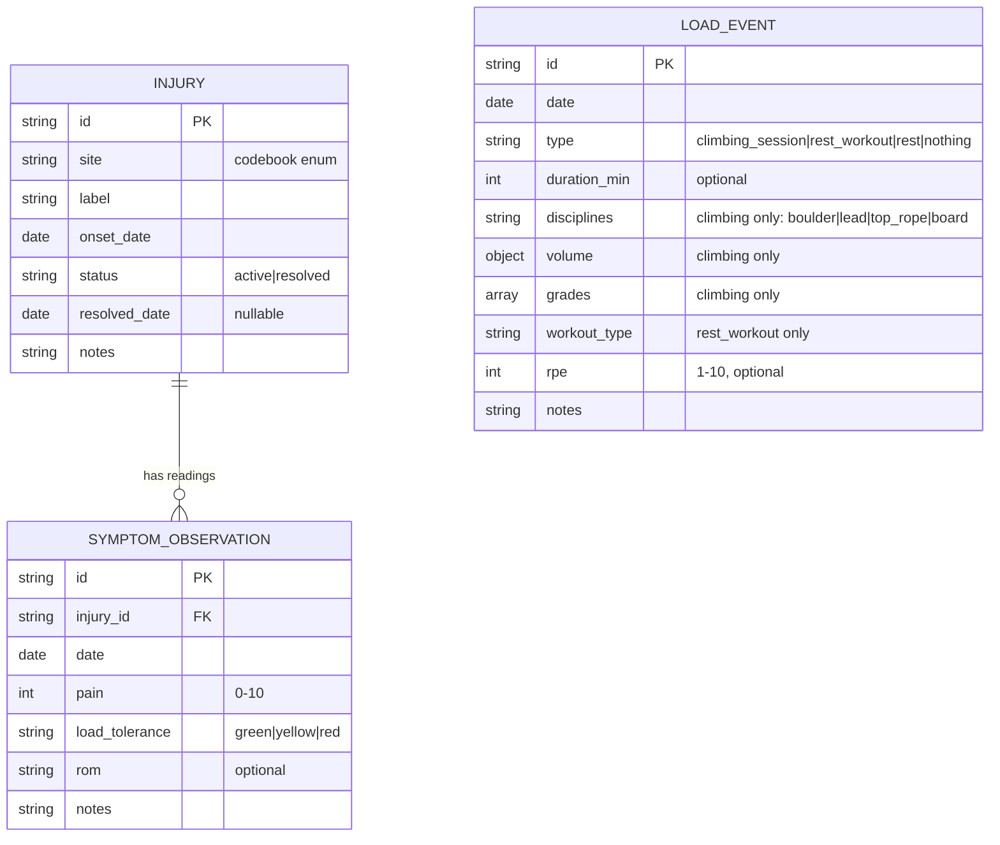

# ✨ Climblog: GitHub-backed climbing & injury journal

## Overview

A single-user web app for logging climbing sessions, rest-day workouts, and injury
feel/recovery — where the **data lives as YAML-frontmatter markdown files in a public
GitHub repo** (source of truth), a **static web app reads it to visualize** progress,
and **entry forms write to it by committing via the GitHub API** behind "Log in with
GitHub." A GitHub Action validates every entry against a shared JSON Schema so the data
stays research-grade from day one.

The whole design reconciles one tension: **daily logging friction vs. research-quality
structure.** Structured frontmatter + CI validation gives clean data; fast forms,
backdating, and a one-tap "nothing" day keep it sustainable to do every day.

**Origin:** all product decisions carried from
`docs/brainstorms/2026-07-19-climblog-pipeline-requirements.md`. Key ones: files-as-truth
(not a DB), reuse GitHub auth instead of building one, two record types (load events +
symptom observations), explicit editable/backdatable date, daily-something habit,
app-driven injury follow-ups. Two forks resolved during this planning session:
**public repo** (reads need no login) and **edit & hard-delete** corrections.

## Problem Statement / Motivation

A ~1-year climber training seriously wants to (a) log *something every day* — climbing,
rest-day work, or injury check-ins — with low enough friction to sustain it, and (b) end
up with a clean longitudinal dataset usable for personal insight now and possible research
later. GitHub is the chosen home: easy daily pushes, durable history, free hosting, and
data that is already version-controlled and portable. Doing nothing means either a prose
log (unsustainable to analyze) or a spreadsheet (abandoned in a week). This system is the
middle path.

## Proposed Solution

```
LOG:    web form  --(validate client-side against shared schema)-->  commit entry file
                    via GitHub Contents API  -->  repo (source of truth)
CHECK:  GitHub Action validates every pushed entry against JSON Schema (backstop)
BUILD:  Cloudflare Pages build compiles entries/ -> data.json, deploys static app
VIEW:   static app fetches compiled data.json (raw CDN) --> timeline + injury curves
AUTH:   "Log in with GitHub" (GitHub App user token via one serverless function)
        reads = anonymous (public repo);  writes = owner-only
```

- **Data = files.** One file per record under `entries/`. Reads and writes both go through
  GitHub; there is no separate database or backend state.
- **Read path is anonymous** (public repo) and cheap: the app fetches a single compiled
  `data.json` from the raw CDN, not hundreds of API calls.
- **Write path is authenticated** and owner-only: a GitHub App user-to-server token,
  obtained via one serverless function that holds the OAuth client secret.
- **Validation happens twice:** client-side before commit (so a bad entry never lands) and
  in CI after push (backstop that keeps the dataset guaranteed-valid).

## Technical Approach

### Architecture

**Repository layout (single repo holds both data and app):**

```
climblog/
├─ entries/
│  ├─ load-events/         2026-07-19--k3f9.md      (one file per record)
│  └─ symptom-observations/2026-07-19--m2a1.md
├─ injuries/               a2-left-ring--p8x2.md    (one file per injury entity)
├─ schema/
│  ├─ load-event.schema.json
│  ├─ symptom-observation.schema.json
│  └─ injury.schema.json                            (canonical enums live here)
├─ codebook.md                                      (human-readable mirror of the schema)
├─ app/                                             (SvelteKit static site + form/dashboard)
├─ functions/                                       (Cloudflare Pages Function: OAuth exchange)
├─ scripts/
│  ├─ validate.py                                   (CI schema validation)
│  └─ compile.mjs                                   (entries/ -> data.json at build)
└─ .github/workflows/validate.yml
```

**Data model (ERD):**



`LOAD_EVENT` and `SYMPTOM_OBSERVATION` are **independent** and related only by `date`
(a day may have load-only, symptom-only, both, or a "nothing" record). Because multiple
records can share a date, `date` is **not** a primary key — each record has a unique `id`
(also in its filename). Exports group by date; they never row-join on date. *(see origin:
docs/brainstorms/2026-07-19-climblog-pipeline-requirements.md, R3/R10 — resolves SpecFlow C4.)*

**Starting codebook (draft — refine during implementation):**

- `load_event.type`: `climbing_session` · `rest_workout` · `rest` · `nothing`
- `discipline`: `boulder` · `lead` · `top_rope` · `board` · `autobelay`
- `workout_type`: `lifting` · `mobility` · `antagonist` · `cardio` · `hangboard` · `other`
- `injury.site`: `finger_a2` · `finger_a4` · `finger_pulley_other` · `elbow_medial` ·
  `elbow_lateral` · `shoulder` · `wrist` · `knee` · `other`
- `load_tolerance`: `green` · `yellow` · `red`
- `pain`: integer `0`–`10`; `rpe`: integer `1`–`10`
- grade scale: pick one canonical scale per discipline (e.g. V-scale for boulder, YDS for
  rope) — **decide exact scales during implementation.**

### Auth & write mechanics (highest-risk area — researched)

- **GitHub App** (not classic OAuth): installed on the single repo, permission
  **`Contents: Read and write` only**. A leaked token can touch nothing else. Classic OAuth
  `repo` scope is all-or-nothing across every private repo — avoid.
- **One serverless function** (Cloudflare Pages Function) holds the client secret and does
  the `code` → token exchange. The browser never sees the secret.
- **Token handling:** GitHub App user tokens are short-lived (~8h) with a 6-month refresh
  token. Keep the refresh token server-side (HttpOnly cookie); hand the browser only the
  short-lived access token, **in memory** (never localStorage). Caps XSS blast radius.
- **Owner-only** enforced in the function (check authenticated login against a one-name
  allowlist) *and* structurally (a random logged-in user has no write access to your repo,
  so their commits fail regardless).
- **Commits via Contents API** `PUT /repos/{owner}/{repo}/contents/{path}`:
  - **Create** a new entry → **no `sha` needed** (most operations are creates → most writes
    can't 409 at all).
  - **Edit / delete** an existing entry → **must pass the current blob `sha`** (omit → 422,
    stale → 409). On 409: refetch latest, re-apply, retry once; if still failing, **preserve
    the entry as a local draft** and surface a clear error — never silent data loss.
    *(resolves SpecFlow C2.)*
  - Base64-encode file content. Seed the repo with an initial commit so the first write
    can't 409 on an empty repo.
- **Rate limits** are a non-issue (5,000 authed req/hr; single-user does single digits/day).
  Bound the retry loop so a stale-SHA storm can't trip a secondary limit.

### Read mechanics

- App fetches a **single compiled `data.json`** built from `entries/` at Cloudflare Pages
  build time, served from the raw CDN — one request, no auth, no API rate limit (avoids the
  60 req/hr unauthenticated cap and "chatty reads").
- **Instant feedback after logging:** on a successful commit the app **optimistically
  updates its in-memory state** (it already holds the entry it just wrote), so the new entry
  appears immediately; the Pages rebuild (~1 min) just makes it durable for the next load.

### Validation

- **One JSON Schema per record type in `schema/`, shared by both** the client-side form
  validation and the CI script — the form can never accept something CI rejects. *(resolves
  SpecFlow I1.)*
- **CI backstop:** `.github/workflows/validate.yml` runs a ~30-line Python script
  (`python-frontmatter` + `jsonschema[format-nongpl]`) that extracts frontmatter, validates
  each file, and emits `::error file=...::` annotations. **Gotcha:** JSON Schema `format`
  (e.g. `date`) is annotation-only by default — must pass a `FormatChecker` or dates won't
  actually be validated.

### Recommended stack (from research; low carrying cost for a solo maintainer)

- **Hosting:** Cloudflare Pages + one Pages Function — static site and OAuth function in
  **one repo, one deploy**; most generous free tier; secret in encrypted env var.
- **Frontend:** SvelteKit with `adapter-static` (cohesive reactive SPA for a form-heavy
  app). *Alt:* Astro + a single Svelte/Preact island. Avoid Next.js (SSR infra unneeded).
- **Charts:** Chart.js (simple, declarative) for pain curves + grade/volume bars at personal
  scale. *(uPlot is faster but unnecessary at this data volume.)*
- **YAML parsing (client):** `js-yaml` directly (not `gray-matter` — avoids a Buffer polyfill).

## Implementation Phases

### Phase 1: Data foundation — loggable via git alone *(delivers value first)*
- Define `schema/*.schema.json` + `codebook.md`; create `entries/`, `injuries/` dirs; seed
  initial commit.
- Write `.github/workflows/validate.yml` + `scripts/validate.py`.
- **Deliverable:** you can start logging *today* by hand-committing valid entry files;
  every push is schema-checked. The habit and the dataset begin before any UI exists.

### Phase 2: Read-only web app
- SvelteKit static app; `scripts/compile.mjs` builds `entries/` → `data.json` at build.
- Views: entry timeline/history + per-injury recovery curve (pain over time). Gaps in a
  curve are shown honestly, not interpolated. *(resolves SpecFlow M1.)*
- **Deliverable:** a live dashboard of hand-logged data. Still no auth (public repo reads).

### Phase 3: Auth + write
- Register GitHub App (Contents: R/W, one repo); build the Cloudflare Pages Function for the
  OAuth code exchange + refresh-token cookie; owner allowlist check.
- Entry forms (load event + symptom observation), client-side schema validation, commit via
  Contents API (create/edit/delete), 409 retry-once, **draft persistence in localStorage**
  so a mobile tab eviction or mid-form token expiry never loses an entry. *(resolves I4.)*
- Explicit editable date field, default today, backdatable; warn on dates far off, block
  future dates unless explicitly confirmed. *(resolves M4.)*
- **Deliverable:** full log-from-the-app on desktop and mobile.

### Phase 4: Daily-habit & injury lifecycle
- "Today isn't logged yet" banner: true iff no load-event record has `date == local today`;
  a `rest`/`nothing` entry satisfies it; backdating never satisfies today. *(resolves C3.)*
- One-tap "nothing"/rest day = a `load_event` with `type: rest|nothing`, other fields null
  (exports cleanly). *(resolves I3.)*
- Injury lifecycle: create (site + onset date + label), resolve (sets status + resolved
  date), reopen (recurrences), and "create injury from a session" (onset defaults to session
  date). Active injuries pin to the top with a "log today's status" action. *(resolves I2.)*
- **Deliverable:** the friction-killers that make daily logging a routine.

### Phase 5 (deferred / future — explicitly out of this scope)
- Export tooling: `scripts/export.*` → tidy `load_events.csv`, `symptom_observations.csv`,
  `injuries.csv` for analysis. (R10 target; a compiled data.json already exists to build on.)
- Advanced analytics: training-load / ACWR injury-risk metric, grade pyramids, rollups.
- Scheduled nudge (Action → GitHub notification/email while an injury is active, or a daily
  "you haven't logged" ping) — only if app-driven prompts prove insufficient.
- Wearable / third-party import (Strava, Apple Health, climbing apps).
- Per-route/project attempt tracking.

## Alternative Approaches Considered
- **No-backend (paste-a-token) auth** — pure static site, fine-grained PAT in browser. Lower
  build cost, but user chose serverless OAuth for the cleaner login UX (accepting one
  function to maintain). *(see origin.)*
- **Full app with own DB + auth** — rejected in brainstorm: heaviest carrying cost and
  undercuts the "GitHub because easy to push daily" premise. *(see origin.)*
- **Append-only / soft-void corrections** — rejected this session in favor of edit &
  hard-delete (simpler; git history is the safety net).
- **Private repo** — rejected this session in favor of public (identifiers fine, sharing
  easy); flipping to private later is a one-click setting + a login-to-read step.

## System-Wide Impact
- **Interaction graph:** form submit → client validate → Contents API commit → push →
  (a) validate Action annotates/fails on bad data; (b) Cloudflare Pages build recompiles
  `data.json` and redeploys → next app load reads fresh data. App also optimistically
  updates local state on commit success.
- **Error propagation:** GitHub API errors (401/403 expired-or-unauthorized token → re-auth
  preserving draft; 422 missing sha → bug guard; 409 stale sha → refetch+retry once → draft
  on repeat failure). CI validation failure is a red check, not a user-facing block (client
  validation should make it unreachable via the happy path).
- **State lifecycle risks:** an un-committed entry is the fragile state → persist as a
  localStorage draft until commit confirms. One-file-per-entry means no partial multi-file
  writes; no orphaning.
- **API surface parity:** every action the app can take (create/edit/delete entry,
  open/resolve/reopen injury) is a plain file commit — so the same actions are always
  doable by hand-editing files in the repo. Keep that parity (agent-native / git-native).
- **Integration scenarios to test:** (1) log yesterday on mobile while today exists on
  desktop → no 409 on create, correct "today" banner state; (2) edit an entry from two tabs
  → 409 → retry → draft preserved; (3) mid-form token expiry → re-auth → draft intact;
  (4) "nothing" day clears today banner and survives reload; (5) invalid grade blocked
  client-side, CI never goes red via the app.

## Acceptance Criteria

### Functional
- [ ] `entries/` supports one file per record (load event, symptom observation) with a
  unique id; `injuries/` holds one file per injury entity.
- [ ] A shared JSON Schema per record type governs both client-side and CI validation.
- [ ] CI fails any push containing a schema-invalid entry, with a per-file error annotation
  (dates actually validated via `FormatChecker`).
- [ ] The app renders an entry timeline and a per-injury recovery (pain-over-time) curve
  from a compiled `data.json`, readable without login (public repo).
- [ ] "Log in with GitHub" (GitHub App, Contents R/W on the one repo) gates all writes;
  only the owner can commit.
- [ ] Create/edit/delete of entries commits via the Contents API (create needs no sha;
  edit/delete pass current sha; 409 → refetch+retry once → draft preserved on repeat fail).
- [ ] Entry date is explicit, editable, defaults to today, and is backdatable; future dates
  are blocked unless explicitly confirmed.
- [ ] "Today isn't logged yet" is shown iff no load-event has `date == local today`;
  rest/nothing satisfies it; backdating never satisfies it.
- [ ] A rest/"nothing" day is loggable in one or two taps.
- [ ] Injuries can be created, resolved, and reopened; active injuries pin to the top with a
  "log today's status" action; an injury can be created from a session (onset = session date).
- [ ] Un-committed entries persist as a local draft across reload / re-auth.

### Non-Functional
- [ ] Logging any entry type takes well under a minute on desktop and mobile (responsive).
- [ ] Client secret never reaches the browser; access token in memory only.
- [ ] A year of entries is exportable to tidy tables without a cleanup pass (schema-guaranteed).

### Quality Gates
- [ ] Integration scenarios (1)–(5) above pass.
- [ ] Schema and codebook.md are consistent.

## Success Metrics
- Daily logging becomes routine — unlogged days are obvious, "nothing" days are trivial.
- 100% of committed entries are schema-valid over time.
- An active injury's day-of → day-after recovery curve is visible in the app.
- No custom auth system was hand-built; only the repo owner can write.

## Dependencies & Prerequisites
- A GitHub account + one repo; ability to register a GitHub App and deploy one Cloudflare
  Pages Function.
- Assumes single user; GitHub API rate limits irrelevant at this volume.

## Risk Analysis & Mitigation
- **Data loss on mobile mid-entry** → localStorage drafts + 409 retry (Phase 3).
- **Schema/codebook drift** → single canonical schema; codebook.md documents it; additive-
  only vocab changes (renames/removals would orphan history — flag before doing them). *(M3.)*
- **Token leakage** → GitHub App single-repo scope + short-lived in-memory token + owner
  allowlist.
- **CI action that commits back could loop** → compile `data.json` at Pages *build* time,
  not by committing back to the repo (no push loop).

## Outstanding Questions (Deferred to Implementation)
- [Affects grades] Exact grade scales per discipline (V-scale, YDS, font, etc.).
- [Affects volume] Exact shape of climbing `volume`/`grades` frontmatter (per-climb list vs.
  counts by grade vs. hardest-send + attempts).
- [Affects schema] Whether to generate the JSON Schema from codebook.md or keep schema
  canonical and codebook.md a manual mirror.
- [Affects Phase 3][Technical] GitHub App vs. OAuth App final choice if refresh-token
  handling proves fiddly (OAuth web flow with token-expiry enabled is the fallback).

## Sources & References

### Origin
- **Origin document:** [docs/brainstorms/2026-07-19-climblog-pipeline-requirements.md](../brainstorms/2026-07-19-climblog-pipeline-requirements.md)
  — carried forward: files-as-truth, reuse-GitHub-auth (serverless OAuth), two record types,
  editable/backdatable date, daily-something habit, app-driven injury prompts. Resolved this
  session: public repo (reads no login), edit & hard-delete corrections.

### External References (2026, from research)
- GitHub OAuth/App auth: [Authorizing OAuth apps](https://docs.github.com/en/apps/oauth-apps/building-oauth-apps/authorizing-oauth-apps) ·
  [Generating a user access token for a GitHub App](https://docs.github.com/en/apps/creating-github-apps/authenticating-with-a-github-app/generating-a-user-access-token-for-a-github-app) ·
  [Refreshing user access tokens](https://docs.github.com/en/apps/creating-github-apps/authenticating-with-a-github-app/refreshing-user-access-tokens) ·
  [Fine-grained PAT permissions](https://docs.github.com/en/rest/authentication/permissions-required-for-fine-grained-personal-access-tokens)
- Commit API: [Using the REST API to interact with your Git database](https://docs.github.com/en/rest/guides/using-the-rest-api-to-interact-with-your-git-database) ·
  [409 conflict discussion](https://github.com/orgs/community/discussions/62198) ·
  [Rate limits](https://docs.github.com/en/rest/using-the-rest-api/rate-limits-for-the-rest-api)
- CI validation: [check-jsonschema](https://check-jsonschema.readthedocs.io/en/latest/usage.html) ·
  [python-jsonschema format FAQ](https://python-jsonschema.readthedocs.io/en/stable/faq/) ·
  [frontmatter-json-schema-action](https://github.com/mheap/frontmatter-json-schema-action)
- Hosting/stack: [Cloudflare Pages Functions](https://developers.cloudflare.com/pages/functions/) ·
  [uPlot](https://github.com/leeoniya/uPlot) · js-yaml, Chart.js, SvelteKit adapter-static

### AI-era notes
- Riskiest surface = the auth + commit + 409/draft handling (Phase 3). Given rapid AI-assisted
  implementation, emphasize the integration test scenarios (1)–(5) rather than trusting unit
  tests with mocked GitHub responses.
- One shared schema file is the single most important invariant — client and CI must import
  the exact same file.
